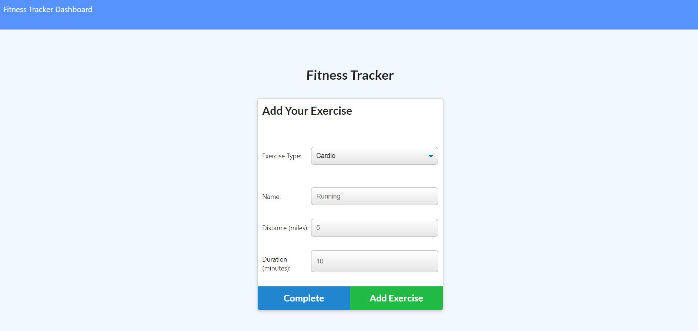

# Employee Tracker

## Badges


## License

Copyright 2020 - Max Guo. Code released under the MIT license.

## User Story
```
As A USER, 
I want to be able to view create and track daily workouts. 
I want to be able to log multiple exercises in a workout on a given day. 
I should also be able to track the name, type, weight, sets, reps, and duration of exercise. 
If the exercise is a cardio exercise, I should be able to track my distance traveled.
```
## Table of Content

* [Description](#Description)
* [Demo](#Demo)
* [Contributing](#Contributing)
* [Reference](#Reference)


## Description

User can create new workoutplan, add exercise to existing workout plan and view their data from dashboard.
User will reach their fitness goals quicker when they track their workout progress.


## Demo
Main Page


Adding Exercise


View Workouts


Demo Link : https://afternoon-chamber-65403.herokuapp.com/

## Contributing

Max, github:https://github.com/Maxguojiaq

## Reference
express NPM: https://www.npmjs.com/package/express
Mongoose: https://mongoosejs.com/
MongoDB: https://www.mongodb.com/

